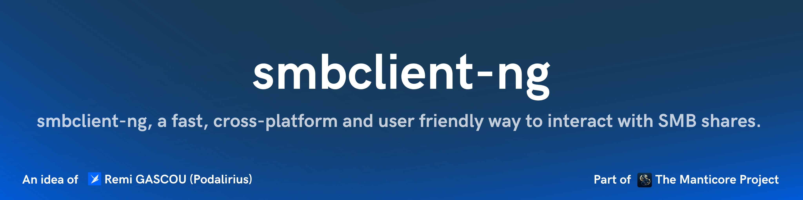
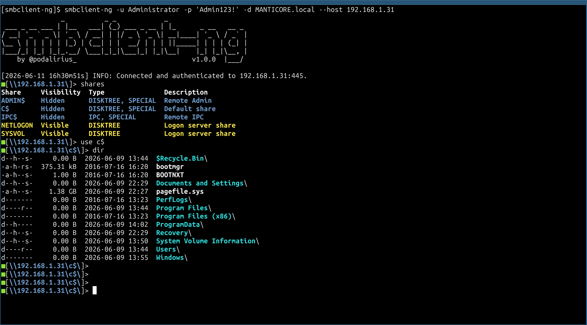

<p align="center">
    smbclient-ng, a fast, cross-platform, and user friendly way to interact with SMB shares.
    <br>
    
    <a href="https://twitter.com/intent/follow?screen_name=podalirius_" title="Follow"></a>
    <a href="https://www.youtube.com/c/Podalirius_?sub_confirmation=1" title="Subscribe"></a>
    <br>
</p>

This is a Go re-implementation of [`p0dalirius/smbclient-ng`](https://github.com/p0dalirius/smbclient-ng), built on top of the [Manticore](https://github.com/TheManticoreProject/Manticore) SMB stack.

## Features

- [ ] `acls`: List ACLs of files and folders in the current directory. Syntax: `acls`
- [x] `bat`: Pretty prints the contents of a remote file. Syntax: `bat <file>`
- [x] `bhead`: Pretty prints the first n lines of a remote file. Syntax: `bhead [-n <lines>] <file>`
- [x] `btail`: Pretty prints the last n lines of a remote file. Syntax: `btail [-n <lines>] <file>`
- [x] `cat`: Get the contents of a remote file. Syntax: `cat <file>`
- [x] `cd`: Change the current working directory. Syntax: `cd <directory>`
- [x] `close`: Closes the SMB connection to the remote machine. Syntax: `close`
- [x] `connect`: Connect to the remote machine (useful if connection timed out). Syntax: `connect`
- [x] `dir`: List the contents of the current remote working directory (alias of `ls`). Syntax: `dir`
- [x] `exit` (alias `quit`): Exits the smbclient-ng script. Syntax: `exit`
- [x] `find`: Search for files in a directory hierarchy. Syntax: `find [-name PATTERN] [-iname PATTERN] [-type f|d] [-maxdepth N] [-mindepth N] [-ls] [PATH ...]`
- [x] `get`: Get a remote file. Syntax: `get <file> [local_file]`
- [x] `head`: Get the first n lines of a remote file. Syntax: `head [-n <lines>] <file>`
- [x] `help`: Displays this help message. Syntax: `help [command]`
- [x] `history`: Displays the command history. Syntax: `history [--contains <string>] [--clear]`
- [x] `info`: Get information about the server and or the share. Syntax: `info <--server|--share>`
- [x] `lbat`: Pretty prints the contents of a local file. Syntax: `lbat <file>`
- [x] `lcat`: Print the contents of a local file. Syntax: `lcat <file>`
- [x] `lcd`: Changes the current local directory. Syntax: `lcd <directory>`
- [x] `lcp`: Create a copy of a local file. Syntax: `lcp <srcfile> <dstfile>`
- [x] `lls`: Lists the contents of the current local directory. Syntax: `lls [directory]`
- [x] `lmkdir`: Creates a new local directory. Syntax: `lmkdir <directory>`
- [x] `lpwd`: Shows the current local directory. Syntax: `lpwd`
- [x] `lrename`: Renames a local file. Syntax: `lrename <oldfilename> <newfilename>`
- [x] `lrm`: Removes a local file. Syntax: `lrm <file>`
- [x] `lrmdir`: Removes a local directory. Syntax: `lrmdir <directory>`
- [x] `ls`: List the contents of the current remote working directory. Syntax: `ls [directory]`
- [x] `ltree`: Displays a tree view of the local directories. Syntax: `ltree [directory]`
- [x] `metadata`: Get metadata about a file or directory. Syntax: `metadata <file|directory>`
- [x] `mget`: Download every remote file matching a wildcard mask. Syntax: `mget <mask>`
- [x] `mkdir`: Creates a new remote directory. Syntax: `mkdir <directory>`
- [ ] `module`: Loads a specific module for additional functionalities. Syntax: `module <name>`
- [ ] `mount`: Creates a mount point of the remote share on the local machine. Syntax: `mount <remote_path> <local_mountpoint>`
- [x] `mv` (alias `rename`, `move`): Move or rename a remote file or directory. Syntax: `mv <source> <destination>`
- [x] `put`: Put a local file or directory in a remote directory. Syntax: `put <local_file> [remote_file]`
- [x] `pwd`: Print the current remote working directory. Syntax: `pwd`
- [x] `reconnect`: Reconnect to the remote machine (useful if connection timed out). Syntax: `reconnect`
- [x] `reset`: Reset the TTY output, useful if it was broken after printing a binary file on stdout. Syntax: `reset`
- [x] `rget`: Recursively download a remote directory tree. Syntax: `rget [directory]`
- [x] `rm` (alias `del`): Removes a remote file. Syntax: `rm <file>`
- [x] `rmdir`: Removes a remote directory. Syntax: `rmdir <directory>`
- [ ] `sessions`: Manage the SMB sessions. Syntax: `sessions [interact|create|delete|execute|list]`
- [x] `shares`: Lists the SMB shares served by the remote machine. Syntax: `shares [-R]`
- [x] `sizeof`: Recursively compute the size of a folder. Syntax: `sizeof [directory|file]`
- [x] `tail`: Get the last n lines of a remote file. Syntax: `tail [-n <lines>] <file>`
- [x] `tree`: Displays a tree view of the remote directories. Syntax: `tree [directory]`
- [ ] `umount`: Removes a mount point of the remote share on the local machine. Syntax: `umount <local_mount_point>`
- [x] `use`: Use a SMB share. Syntax: `use <sharename>`


## Install

Build from source with Go (≥ 1.24). The tool builds against the in-development Manticore SMB stack, which `go.mod` references through a local `replace` directive, so check out both repositories side by side:

```
git clone https://github.com/TheManticoreProject/Manticore
git clone https://github.com/TheManticoreProject/smbclient-ng
cd smbclient-ng
go build -o smbclient-ng .
```

## Demonstration



## Usage

```
$ ./smbclient-ng
               _          _ _            _
 ___ _ __ ___ | |__   ___| (_) ___ _ __ | |_      _ __   __ _
/ __| '_ ` _ \| '_ \ / __| | |/ _ \ '_ \| __|____| '_ \ / _` |
\__ \ | | | | | |_) | (__| | |  __/ | | | ||_____| | | | (_| |
|___/_| |_| |_|_.__/ \___|_|_|\___|_| |_|\__|    |_| |_|\__, |
    by @podalirius_                             v1.0.0  |___/

Usage: smbclient-ng [--debug] [--domain <string>] [--username <string>] [--password <string>] [--hashes <string>] [--use-kerberos] --host <string> [--port <tcp port>] [--nbt]

  --debug         Debug mode. (default: false)

  Authentication:
    -d, --domain <string>   Windows domain to authenticate to. Use '.' for local accounts. (default: ".")
    -u, --username <string> User to authenticate as. (default: "")
    -p, --password <string> Password to authenticate with. (default: "")
    --hashes <string>       NT/LM hashes, format is LMhash:NThash. (default: "")

  Connection Settings:
    -k, --use-kerberos Use Kerberos instead of NTLM. (not yet supported by the Manticore SMB stack) (default: false)

  Target:
    -H, --host <string>   IP address or hostname of the SMB server to connect to.
    -P, --port <tcp port> Port number to connect to on the SMB server. (default: 445)
    --nbt                 Use NetBIOS (NBT) transport instead of direct TCP. (default: false)
```

## Quick start commands

 + Connect to a remote SMB server:
    ```
    smbclient-ng --host 10.0.0.201 -d "LAB" -u "Administrator" -p 'Admin123!'
    ```

## Contributing

Pull requests are welcome. Feel free to open an issue if you want to add other features.
